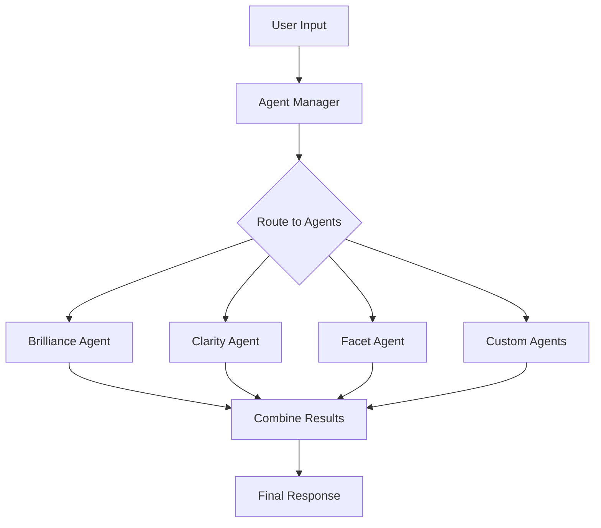

# GemVise: Modular Agent Architecture for Interactive Gems

GemVise is an advanced, modular agent architecture that enables dynamic interactions with personalized gems through configurable JSON initialization. The system emphasizes extensibility, allowing easy integration of new agents and capabilities.

## Core Features

### 1. Modular Agent System
- **Base Agent Framework**: Extensible agent system with standardized interfaces
- **Agent Manager**: Coordinates agent interactions and transformations
- **Built-in Agents**:
  - Brilliance Agent: Enhances content impact through gem metaphors
  - Clarity Agent: Improves understanding and coherence
  - Facet Agent: Manages different aspects of gem personality
  - Self-Learning Agent: Enables gems to learn through multi-persona dialogue

### 2. Gem Initialization
```json
{
  "gem_id": "unique_identifier",
  "name": "Gem Name",
  "expertise": ["Topic 1", "Topic 2"],
  "initial_state": {
    "quantum": {
      "coherence": 0.7,
      "energy": 0.8,
      "phase": 0.5,
      "uncertainty": 0.3
    },
    "knowledge": {
      "topics": ["domain_knowledge_1", "domain_knowledge_2"],
      "skills": ["skill_1", "skill_2"]
    }
  },
  "transformation_config": {
    "agents": ["brilliance", "clarity", "facet"],
    "style_preferences": {
      "language_level": "advanced",
      "metaphor_usage": "high",
      "tone": "professional"
    }
  }
}
```

### 3. Quantum State Management
- **Coherence**: Message consistency and clarity
- **Energy**: Activity and impact level
- **Phase**: Evolution and development stage
- **Uncertainty**: Adaptability and exploration

### 4. Learning System
- Multi-persona learning through different roles:
  - Teacher: Structured knowledge sharing
  - Student: Exploratory learning
  - Critic: Analytical refinement
  - Innovator: Creative synthesis

## Quick Start

1. **Install GemVise**
```bash
pip install gemvise
```

2. **Initialize a Gem**
```python
from gemvise import GemVise

# Load gem configuration
with open('gem_init.json', 'r') as f:
    config = json.load(f)

# Initialize GemVise
gemvise = GemVise()

# Create gem from config
gem = gemvise.create_gem(config)

# Start interaction
response = await gem.get_response("Your question here")
```

3. **Add Custom Agent**
```python
from gemvise.transformers import TransformationAgent

class CustomAgent(TransformationAgent):
    def __init__(self, config):
        super().__init__(config)
        
    def transform(self, content, context):
        # Custom transformation logic
        return transformed_content
```

## Architecture

### Agent Manager Flow


## Future Extensions (Phase 2)

1. **External System Integration**
   - E-commerce integration for product-aware gems
   - Order history analysis
   - Customer service automation
   - CRM system integration

2. **Advanced Features**
   - Real-time gem state updates
   - Multi-gem interactions
   - Dynamic agent loading
   - Custom transformation pipelines

3. **API Extensions**
   - RESTful API for gem management
   - WebSocket support for real-time interactions
   - Bulk gem operations
   - State persistence and recovery

## Contributing

1. Fork the repository
2. Create a feature branch
3. Add your agent or feature
4. Submit a pull request

## License

MIT License - See LICENSE file for details
