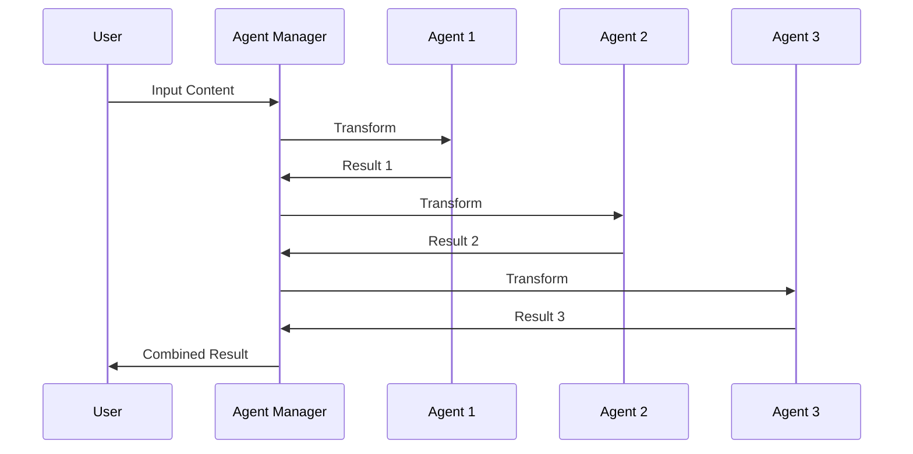

# GemVise Agent System

## Overview

The GemVise agent system is designed for maximum extensibility and modularity. Each agent is responsible for a specific aspect of gem behavior and can be easily combined with others through the Agent Manager.

## Core Concepts

### 1. Base Agent
All agents inherit from `TransformationAgent`, which provides:
- Standard interface for transformations
- Quantum state management
- Configuration handling
- Context awareness

### 2. Agent Manager
Coordinates agent interactions:
- Routes content through appropriate agents
- Manages transformation order
- Handles agent dependencies
- Combines agent outputs

### 3. Built-in Agents

#### Brilliance Agent
Enhances content impact through:
- Gem metaphors
- Language elevation
- Impact amplification
- Value emphasis

```json
{
  "agent_type": "brilliance",
  "config": {
    "metaphor_level": 0.8,
    "language_sophistication": 0.7,
    "impact_threshold": 0.6
  }
}
```

#### Clarity Agent
Improves understanding through:
- Structure enhancement
- Concept clarification
- Example generation
- Coherence maintenance

```json
{
  "agent_type": "clarity",
  "config": {
    "structure_level": 0.8,
    "example_frequency": 0.6,
    "simplification_threshold": 0.7
  }
}
```

#### Facet Agent
Manages personality aspects:
- Expertise areas
- Communication style
- Value alignment
- Behavioral consistency

```json
{
  "agent_type": "facet",
  "config": {
    "expertise_areas": ["domain1", "domain2"],
    "communication_style": "professional",
    "value_alignment": ["value1", "value2"]
  }
}
```

#### Self-Learning Agent
Enables multi-persona learning:
- Role-based dialogues
- Knowledge integration
- Insight generation
- Progressive learning

```json
{
  "agent_type": "self_learning",
  "config": {
    "personas": ["teacher", "student", "critic", "innovator"],
    "learning_rate": 0.7,
    "exploration_rate": 0.6
  }
}
```

## Creating Custom Agents

1. **Create Agent Class**
```python
from gemvise.transformers import TransformationAgent

class CustomAgent(TransformationAgent):
    def __init__(self, config):
        super().__init__(config)
        self.custom_config = config.get('custom_settings', {})
        
    def transform(self, content, context):
        # Custom transformation logic
        return transformed_content
        
    def get_state_effects(self):
        return {
            'coherence': 0.1,
            'energy': 0.2,
            'phase': 0.1,
            'uncertainty': -0.1
        }
```

2. **Register Agent**
```python
from gemvise.transformers import register_agent

@register_agent('custom')
class CustomAgent(TransformationAgent):
    pass
```

3. **Configure Agent**
```json
{
  "agent_type": "custom",
  "config": {
    "custom_settings": {
      "parameter1": "value1",
      "parameter2": "value2"
    }
  }
}
```

## Agent Interaction Flow



## Best Practices

1. **Agent Design**
   - Keep agents focused on single responsibility
   - Make transformations idempotent
   - Handle edge cases gracefully
   - Document state effects

2. **Configuration**
   - Use clear parameter names
   - Provide default values
   - Validate inputs
   - Document expected ranges

3. **State Management**
   - Update quantum state appropriately
   - Avoid large state changes
   - Document state effects
   - Handle state conflicts

4. **Performance**
   - Optimize heavy operations
   - Cache when possible
   - Handle async operations
   - Monitor resource usage
