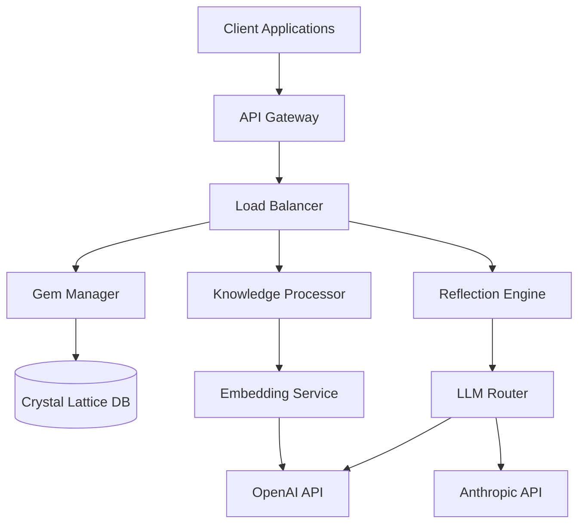
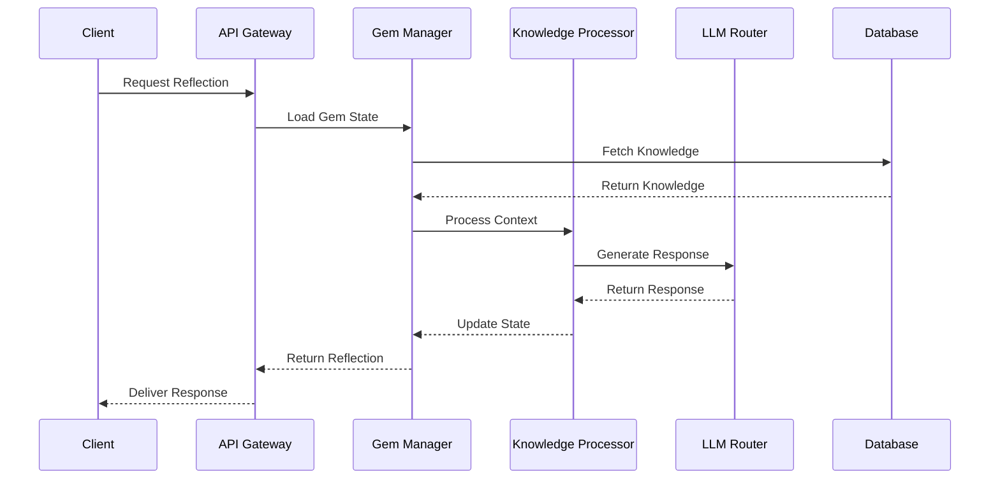
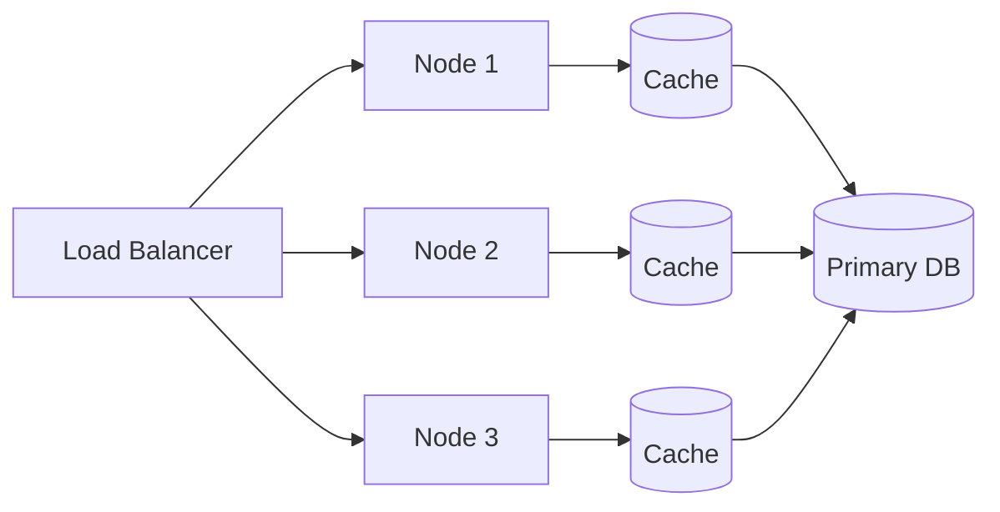
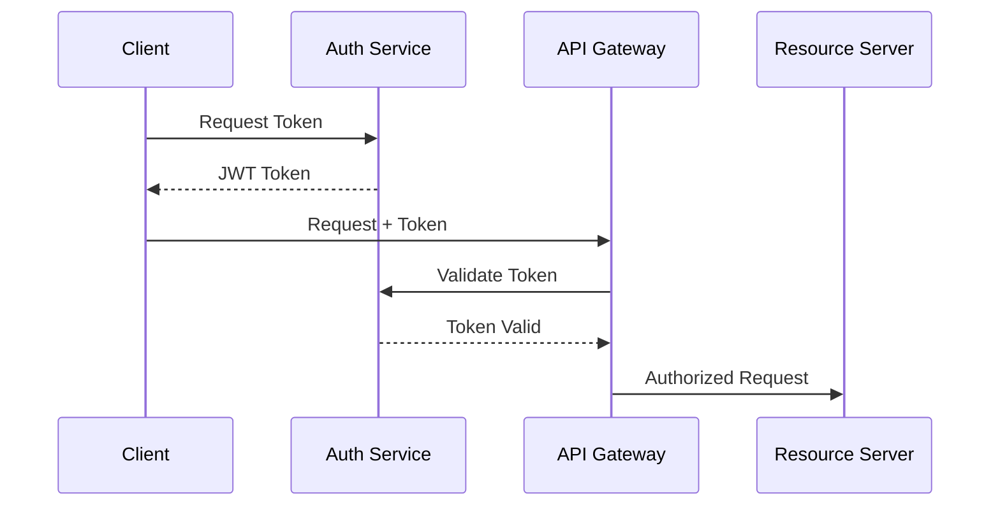
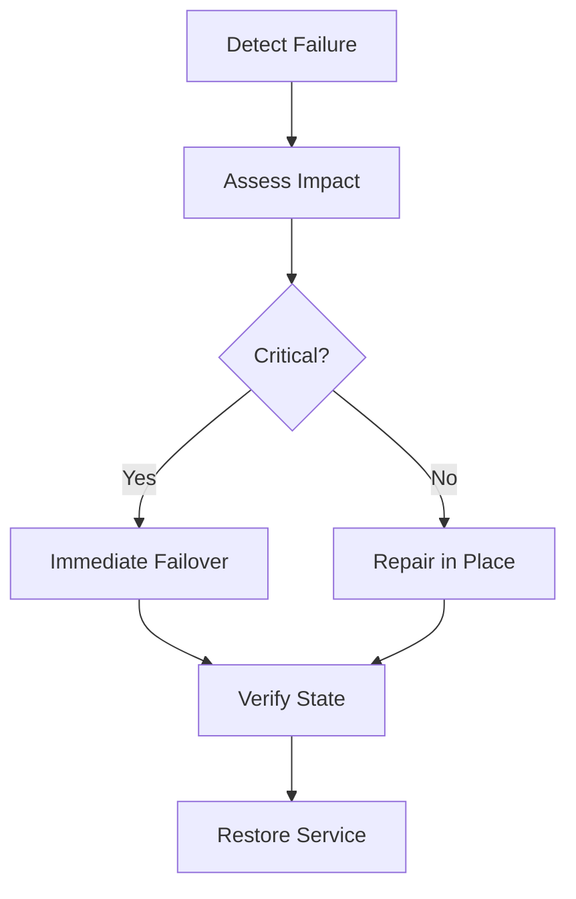

# System Architecture

## High-Level Overview



## Core Components

### 1. Gem Manager
- Handles Gem lifecycle
- Manages quantum states
- Coordinates entanglement
- Monitors coherence

### 2. Knowledge Processor
- Generates embeddings
- Calculates resonance
- Manages interference patterns
- Handles batch processing

### 3. Reflection Engine
- Generates responses
- Maintains context
- Handles fallbacks
- Optimizes prompts

## Data Flow



## Quantum-Inspired Features

### State Management
```python
class QuantumState:
    def __init__(self):
        self.energy = 1.0
        self.phase = 0.0
        self.coherence = 1.0
        self.uncertainty = 0.1
        
    def evolve(self, dt):
        """Time evolution of quantum state."""
        self.coherence *= np.exp(-dt/self.energy)
        self.phase += self.energy * dt
        self.uncertainty = min(1.0, self.uncertainty + dt/10)
```

### Interference Patterns
```python
def calculate_interference(state1, state2):
    """Calculate quantum interference between states."""
    phase_diff = state1.phase - state2.phase
    return np.cos(phase_diff) * state1.coherence * state2.coherence
```

## Scaling Strategy

### Horizontal Scaling


### Vertical Scaling
- CPU optimization
- Memory management
- I/O optimization
- Cache strategies

## Security Architecture

### Authentication Flow


### Data Protection
- Encryption at rest
- TLS in transit
- Key rotation
- Access control

## Monitoring & Observability

### Metrics
- Quantum coherence
- Response latency
- Cache hit ratio
- Error rates

### Logging
```python
class QuantumLogger:
    def log_state_change(self, gem_id, old_state, new_state):
        """Log quantum state transitions."""
        logger.info(
            "Gem state change",
            extra={
                "gem_id": gem_id,
                "coherence_delta": new_state.coherence - old_state.coherence,
                "energy_level": new_state.energy,
                "timestamp": time.time()
            }
        )
```

## Disaster Recovery

### Backup Strategy
1. Regular state snapshots
2. Transaction logs
3. Cross-region replication
4. Automated recovery

### Recovery Process


## Performance Optimization

### Caching Strategy
```python
class ResonanceCache:
    def __init__(self):
        self.cache = LRUCache(maxsize=1000)
        
    async def get_resonance(self, pattern):
        """Get cached resonance pattern."""
        if pattern in self.cache:
            return self.cache[pattern]
        
        resonance = await self.calculate_resonance(pattern)
        self.cache[pattern] = resonance
        return resonance
```

### Load Distribution
- Geographic distribution
- Load balancing
- Auto-scaling
- Rate limiting

## Future Architecture

### Planned Enhancements
1. Quantum-inspired distributed processing
2. Advanced entanglement networks
3. Self-optimizing knowledge structures
4. Dynamic scaling based on coherence

### Research Areas
- Quantum algorithms
- Neural-quantum interfaces
- Coherence preservation
- Pattern emergence
