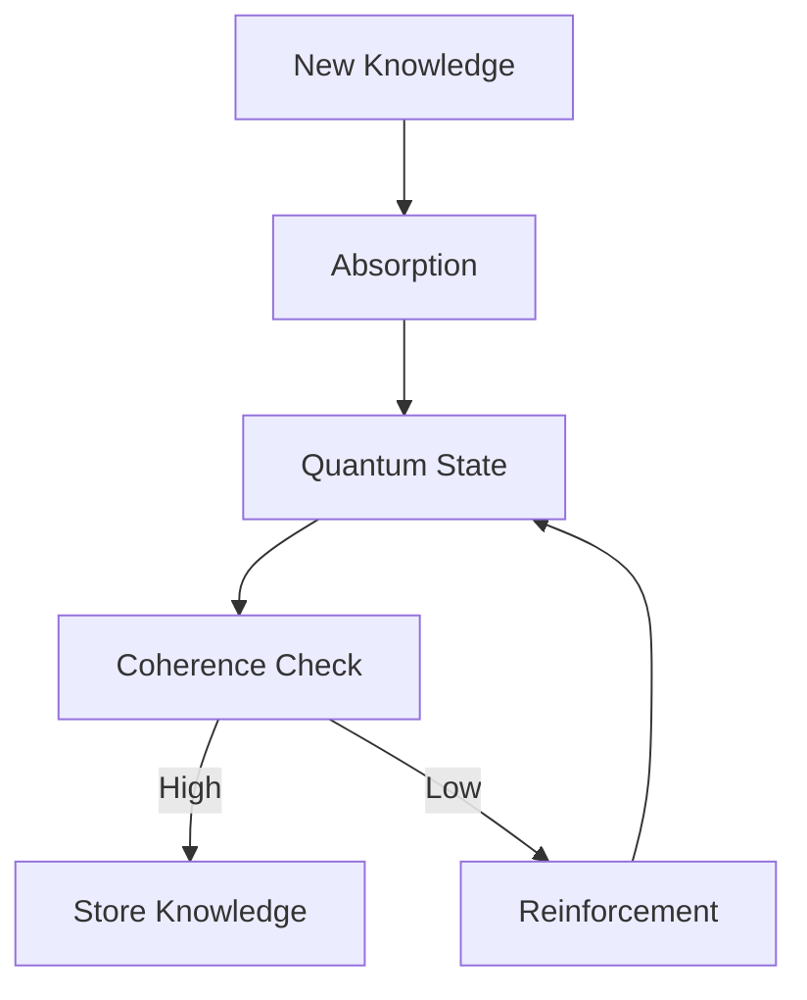
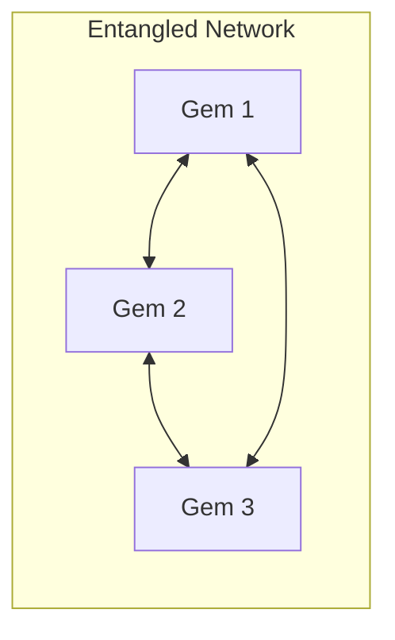

# Innovation & Unique Features

## Quantum-Inspired Architecture

### Novel Concepts
1. **Crystal Lattice Knowledge Structure**
   - Inspired by crystalline materials
   - Knowledge points as quantum nodes
   - Interference patterns for relevance
   - Energy-based importance weighting

2. **Quantum State Management**
   ```python
   class QuantumState:
       def __init__(self):
           self.energy = 1.0      # Knowledge importance
           self.phase = 0.0       # Temporal alignment
           self.coherence = 1.0   # Information stability
           self.uncertainty = 0.1 # Heisenberg-inspired uncertainty
   ```

3. **Resonance Matching**
   - Knowledge retrieval via quantum resonance
   - Phase-based interference patterns
   - Coherence-weighted relevance
   - Uncertainty-aware responses

## Advanced Features

### 1. Adaptive Learning


### 2. Self-Optimization
- Dynamic coherence adjustment
- Automatic resonance tuning
- Energy level optimization
- Phase synchronization

### 3. Emergent Behavior
```python
class EmergentProperties:
    def calculate_emergence(self, knowledge_network):
        """Calculate emergent properties from knowledge interactions."""
        nodes = knowledge_network.get_nodes()
        interference_matrix = np.zeros((len(nodes), len(nodes)))
        
        for i, node1 in enumerate(nodes):
            for j, node2 in enumerate(nodes):
                interference_matrix[i,j] = self.quantum_interference(node1, node2)
        
        eigenvalues, eigenvectors = np.linalg.eig(interference_matrix)
        return self.analyze_emergence_patterns(eigenvalues, eigenvectors)
```

## Competitive Advantages

### 1. Knowledge Representation
- **Traditional Systems**: Flat or hierarchical storage
- **GemVise**: Quantum-inspired interconnected network
  ```python
  class KnowledgeNode:
      def __init__(self):
          self.connections = WeightedGraph()
          self.quantum_state = QuantumState()
          self.resonance_field = ResonanceField()
  ```

### 2. Response Generation
- **Traditional Systems**: Direct pattern matching
- **GemVise**: Quantum interference-based relevance
  ```python
  def generate_response(self, query):
      resonance = self.calculate_resonance(query)
      interference_pattern = self.get_interference_pattern(resonance)
      return self.synthesize_response(interference_pattern)
  ```

### 3. Adaptation & Learning
- **Traditional Systems**: Fixed updates
- **GemVise**: Continuous quantum evolution
  ```python
  def evolve_knowledge(self, dt):
      self.update_coherence(dt)
      self.adjust_phase_relationships()
      self.optimize_energy_levels()
  ```

## Technical Innovation

### 1. Quantum-Classical Bridge
```python
class QuantumClassicalBridge:
    def __init__(self):
        self.classical_state = ClassicalState()
        self.quantum_state = QuantumState()
        
    def bridge_knowledge(self, classical_input):
        """Transform classical information into quantum state."""
        quantum_representation = self.quantize_information(classical_input)
        return self.superposition_state(quantum_representation)
```

### 2. Dynamic Resonance Fields
```python
class ResonanceField:
    def __init__(self):
        self.field_strength = 1.0
        self.interference_patterns = {}
        
    def update_field(self, new_knowledge):
        """Update resonance field with new knowledge."""
        field_perturbation = self.calculate_perturbation(new_knowledge)
        self.propagate_changes(field_perturbation)
```

### 3. Coherence Preservation
```python
class CoherenceManager:
    def maintain_coherence(self, quantum_state):
        """Maintain quantum coherence over time."""
        if quantum_state.coherence < THRESHOLD:
            self.apply_quantum_error_correction()
            self.reinforce_state_stability()
```

## Future Innovations

### 1. Quantum Entanglement Networks


### 2. Self-Evolving Architecture
- Automatic topology optimization
- Dynamic capacity scaling
- Emergent pattern recognition
- Self-healing capabilities

### 3. Hybrid Quantum Processing
```python
class HybridProcessor:
    def process_knowledge(self, input_data):
        """Process information using both quantum and classical methods."""
        classical_result = self.classical_processing(input_data)
        quantum_result = self.quantum_processing(input_data)
        return self.hybrid_synthesis(classical_result, quantum_result)
```

## Research Directions

### 1. Advanced Quantum Algorithms
- Quantum-inspired search
- Interference-based ranking
- Coherence optimization
- Phase-space navigation

### 2. Neural-Quantum Integration
```python
class NeuralQuantumNetwork:
    def __init__(self):
        self.neural_layers = NeuralNetwork()
        self.quantum_processor = QuantumProcessor()
        
    def forward(self, input_data):
        """Process data through neural-quantum network."""
        neural_features = self.neural_layers(input_data)
        return self.quantum_processor.process(neural_features)
```

### 3. Emergent Intelligence
- Pattern emergence study
- Collective behavior analysis
- Self-organization principles
- Quantum consciousness models
